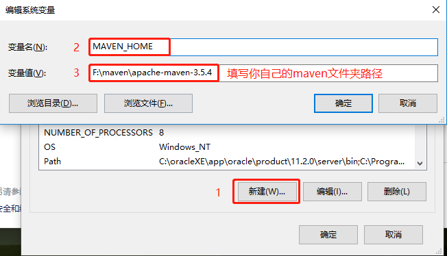
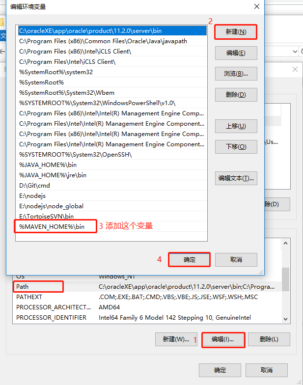
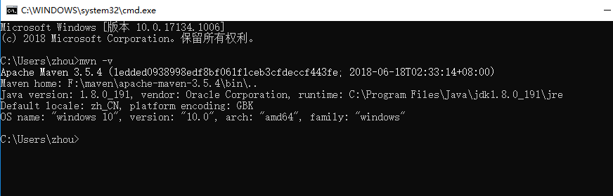

# maven的简单安装与配置

## 1.下载maven包，解压

- 下载地址`http://maven.apache.org/download.cgi`

- 创建自己本地的maven仓库

> 我的目录：

```
maven
├─── apache-maven-3.5.4
└─── repository
```

## 2.配置maven环境变量（win10）

- 新建`MAVEN_HOME`系统环境变量



- 系统环境变量`path`添加`%MAVEN_HOME%\bin`



## 3.验证环境变量是否添加成功

- `cmd`运行黑窗口，`mvn -v`，配置成功如下：



## 4.修改`settings.xml`配置文件

::: tip
位置：`maven/apache-maven-3.5.4/conf/settings.xml`
:::

- 添加本地仓库路径

```xml
<localRepository>E:/maven/repository</localRepository>
```

- 设置阿里云远程仓库

```xml
<mirror>
	<id>alimaven</id>
	<name>aliyun maven</name>
	<url>http://maven.aliyun.com/nexus/content/groups/public/</url>
	<mirrorOf>central</mirrorOf>
</mirror>
```

- jdk指定版本

```xml
<profile>  
	<id>jdk-1.8</id>  
	<activation>  
		<activeByDefault>true</activeByDefault>  
		 <jdk>1.8</jdk>  
	</activation>  
	<properties>  
		<maven.compiler.source>1.8</maven.compiler.source>  
		<maven.compiler.target>1.8</maven.compiler.target>  
		<maven.compiler.compilerVersion>1.8</maven.compiler.compilerVersion>  
	</properties>
</profile>
```