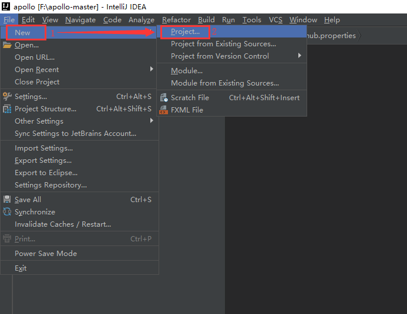
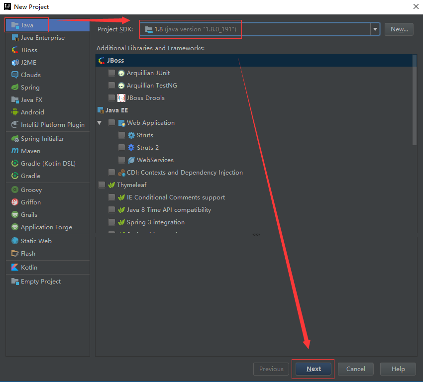
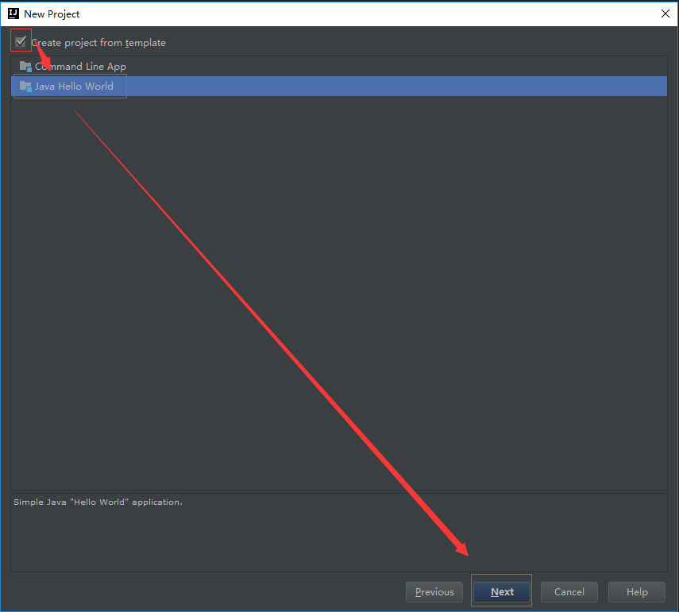
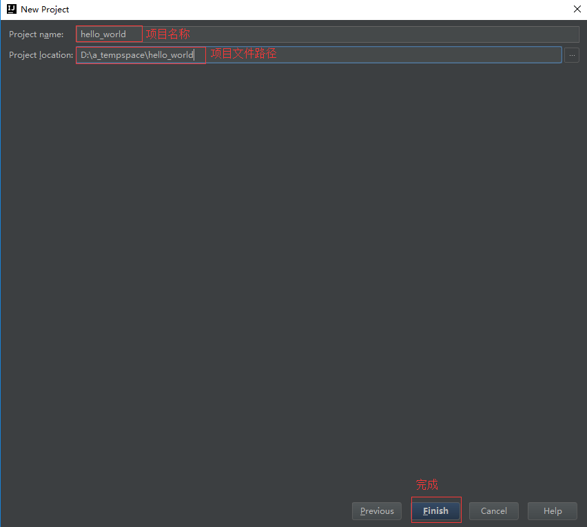
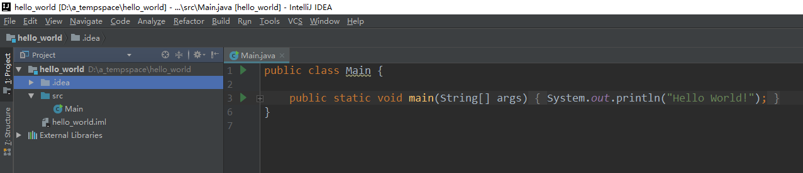
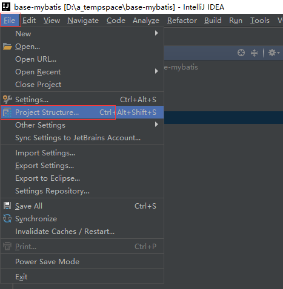
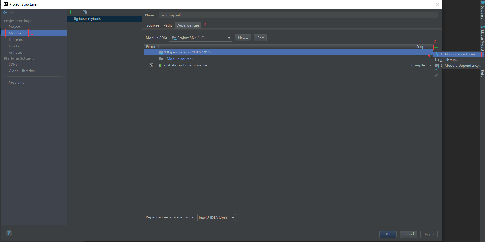
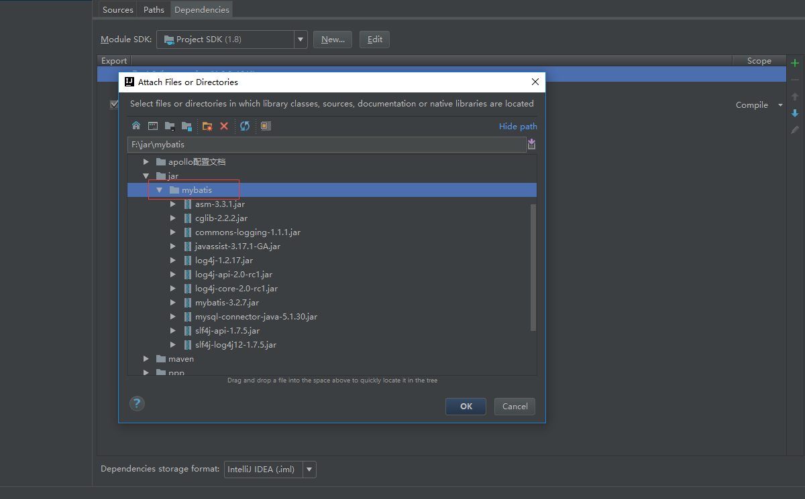
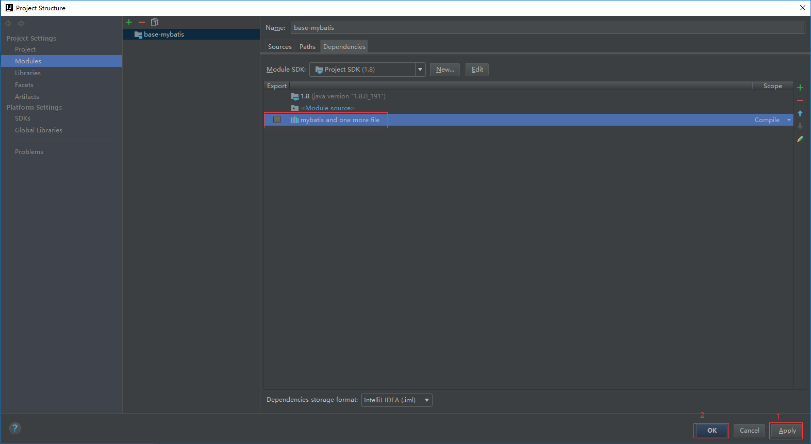

## 1.创建项目

1. `File`---`New`---`Project`

2. 选择`Java`---`Project SDK`---`Next`

3. 勾选`Create project…`---`Java Hello World`---`Next`

4. 输入`Project name`项目名称，自定义`Project location`项目文件路径，`finish`完成

5. 完成后打开项目

## 2.导入jar

1. `File`---`Project Structure`

2. 点击`modules`---`Dependencies`---`+`---`JARs or …`

3. 选择本地jar包文件夹

4. 应用并关闭，`Apply`---`OK`

