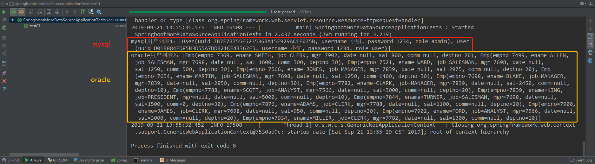

# 	springboot整合mybatis使用xml文件配置多数据源

## 1.环境准备
- 从`https://start.spring.io`上拉一个基础的springboot项目，只包含`spring-boot-starter-web`和`spring-boot-starter-test`依赖

::: warning
springboot环境的版本不能太高，会和有些jar起冲突，我用的是`1.5.4.RELEASE`
:::

>该项目所有用到来的pom文件依赖，不包含`spring-boot-starter-web`和`spring-boot-starter-test`

```xml
<!-- lombok工具（没用过的去baidu） -->
<dependency>
	<groupId>org.projectlombok</groupId>
	<artifactId>lombok</artifactId>
	<optional>true</optional>
</dependency>
<!-- springboot整合mybatis -->
<dependency>
	<groupId>org.mybatis.spring.boot</groupId>
	<artifactId>mybatis-spring-boot-starter</artifactId>
	<version>1.1.1</version>
</dependency>
<!-- spring整合mybatis -->
<dependency>
	<groupId>org.mybatis</groupId>
	<artifactId>mybatis-spring</artifactId>
	<version>2.0.2</version>
</dependency>
<!-- dbcp数据库连接池所需依赖 -->
<dependency>
	<groupId>org.apache.commons</groupId>
	<artifactId>commons-dbcp2</artifactId>
</dependency>
<dependency>
	<groupId>org.apache.commons</groupId>
	<artifactId>commons-pool2</artifactId>
</dependency>
<!-- oracle连接驱动 -->
<dependency>
	<groupId>com.oracle</groupId>
	<artifactId>ojdbc7</artifactId>
	<version>1.0.0</version>
</dependency>
<!-- mysql连接驱动 -->
<dependency>
	<groupId>mysql</groupId>
	<artifactId>mysql-connector-java</artifactId>
	<version>5.1.45</version>
</dependency>
```
::: warning
其中oracle连接驱动只能从本地导入
1. 先下载jar包到本地
2. 执行maven导入命令：  
	mvn install:install-file  
	-Dfile=本地jar文件绝对路径  
	-DgroupId=包名  
	-DartifactId=文件名  
	-Dversion=版本号  
	-Dpackaging=jar
3. 导入成功后，再手动加入依赖 
:::

## 2.创建文件目录

- 启动类主目录下创建`config`包、`pojo`包，`resources`目录下新建`spring`文件夹、`mapper`文件夹

## 3.创建数据源配置文件

- 在`resources/spring`目录下新建`mybatis-mysql.xml`和`mybatis-oracle.xml`文件夹

> mybatis-mysql.xml
```xml
<?xml version="1.0" encoding="UTF-8"?>
<beans xmlns="http://www.springframework.org/schema/beans"
       xmlns:xsi="http://www.w3.org/2001/XMLSchema-instance"
       xsi:schemaLocation="http://www.springframework.org/schema/beans http://www.springframework.org/schema/beans/spring-beans.xsd">
    <!-- 数据源封装，获取数据库连接 -->
    <bean id="datasourceMysql" class="org.apache.commons.dbcp2.BasicDataSource">
        <property name="driverClassName" value="com.mysql.jdbc.Driver"></property>
        <property name="url" value="jdbc:mysql://localhost:3306/mybase"></property>
        <property name="username" value="root"></property>
        <property name="password" value="123456"></property>
    </bean>
    <!-- 创建SqlSessionFactory对象-->
    <bean id="sqlSessionFactoryMysql" class="org.mybatis.spring.SqlSessionFactoryBean">
        <property name="dataSource" ref="datasourceMysql" />
        <property name="mapperLocations" value="classpath:mapper/**/*Mapper.xml" />
        <!-- <property name="configLocation" value="classpath:spring/mybatis-config.xml" /> -->
    </bean>
    <!-- 创建sqlSessionTemplate对象-->
    <bean id="sqlSessionTemplateMysql" class="org.mybatis.spring.SqlSessionTemplate">
        <constructor-arg index="0" ref="sqlSessionFactoryMysql" />
    </bean>
</beans>
```

> mybatis-oracle.xml

```xml
<?xml version="1.0" encoding="UTF-8"?>
<beans xmlns="http://www.springframework.org/schema/beans"
       xmlns:xsi="http://www.w3.org/2001/XMLSchema-instance"
       xsi:schemaLocation="http://www.springframework.org/schema/beans http://www.springframework.org/schema/beans/spring-beans.xsd">
    <!-- 数据源封装，获取数据库连接 -->
    <bean id="datasourceOracle" class="org.apache.commons.dbcp2.BasicDataSource">
        <property name="driverClassName" value="oracle.jdbc.driver.OracleDriver"></property>
        <property name="url" value="jdbc:oracle:thin:@127.0.0.1:1521/XE"></property>
        <property name="username" value="scott"></property>
        <property name="password" value="123456"></property>
    </bean>
    <!-- 创建SqlSessionFactory对象-->
    <bean id="sqlSessionFactoryOracle" class="org.mybatis.spring.SqlSessionFactoryBean">
        <property name="dataSource" ref="datasourceOracle" />
        <property name="mapperLocations" value="classpath:mapper/**/*Mapper.xml" />
        <!-- <property name="configLocation" value="classpath:spring/mybatis-config.xml" /> -->
    </bean>
    <!-- 创建sqlSessionTemplate对象-->
    <bean id="sqlSessionTemplateOracle" class="org.mybatis.spring.SqlSessionTemplate">
        <constructor-arg index="0" ref="sqlSessionFactoryOracle" />
    </bean>
</beans>
```

## 4.创建spring全局配置文件

- 在`resources/spring`下新建`spring-context.xml`全局配置文件

> spring-context.xml

```xml
<?xml version="1.0" encoding="UTF-8"?>
<beans xmlns="http://www.springframework.org/schema/beans"
       xmlns:xsi="http://www.w3.org/2001/XMLSchema-instance"
       xsi:schemaLocation="http://www.springframework.org/schema/beans http://www.springframework.org/schema/beans/spring-beans.xsd">
	   
    <import resource="classpath:spring/mybatis-mysql.xml" />
    <import resource="classpath:spring/mybatis-oracle.xml" />
    
</beans>
```

## 5.创建springboot读取XML文件配置类

- 在`config`包下创建`XMLConfig`类

> XMLConfig

```java
@Configuration
@ImportResource(locations = {"classpath:spring/spring-context.xml"})
public class XMLConfig {
    
}
```
## 6.pojo实体类创建

> mysql数据库中的`User`
```java
@Data
public class User {
    private String uuid;
    private String username;
    private String password;
    private String role;
}
```

> oracle数据库中的`Emp`

```java
@Data
public class Emp {
    private Integer empno;
    private String ename;
    private String job;
    private Integer mgr;
    private String date;
    private Integer sal;
    private Integer comm;
    private Integer deptno;
}
```

## 7.`*mapper.xml`SQL语句编写

> UserMapper.xml

```xml
<?xml version="1.0" encoding="UTF-8"?>
<!DOCTYPE mapper PUBLIC "-//mybatis.org//DTD Mapper 3.0//EN"
        "http://mybatis.org/dtd/mybatis-3-mapper.dtd">
<mapper namespace="com.xiaoming.mapper.UserMapper">
    <select id="selAllUser" resultType="com.xiaoming.springbootmoreDataSource.pojo.User">
        SELECT * FROM T_USER
    </select>
</mapper>
```
> EmpMapper.xml

```xml
<?xml version="1.0" encoding="UTF-8"?>
<!DOCTYPE mapper PUBLIC "-//mybatis.org//DTD Mapper 3.0//EN"
        "http://mybatis.org/dtd/mybatis-3-mapper.dtd">
<mapper namespace="com.xiaoming.mapper.EmpMapper">
    <select id="selAllEmp" resultType="com.xiaoming.springbootmoreDataSource.pojo.Emp">
        SELECT * FROM EMP
    </select>
</mapper>
```

## 8.修改启动类
- 在启动类上添加`@EnableAutoConfiguration(exclude={DataSourceAutoConfiguration.class})`注解，大致意思是使用了自定义的datasource源，需要把springboot自动创建数据源的的功能关闭

```java
@EnableAutoConfiguration(exclude={DataSourceAutoConfiguration.class})
@SpringBootApplication
public class SpringbootMoreDataSourceApplication {
	public static void main(String[] args) {
		SpringApplication.run(SpringbootMoreDataSourceApplication.class, args);
	}
}
```

## 9.测试

> 测试代码

```java
@RunWith(SpringRunner.class)
@SpringBootTest
public class SpringbootMoreDataSourceApplicationTests {

	@Autowired
	@Qualifier("sqlSessionTemplateMysql")
	private SqlSessionTemplate sqlSessionTemplateMysql;

	@Autowired
	@Qualifier("sqlSessionTemplateOracle")
	private SqlSessionTemplate sqlSessionTemplateOracle;

	@Test
	public void test01() {

		List<User> mysql = sqlSessionTemplateMysql.selectList("com.xiaoming.mapper.UserMapper.selAllUser");
		System.out.println("mysql用户列表1：" + mysql);

		List<Emp> orcale = sqlSessionTemplateOracle.selectList("com.xiaoming.mapper.EmpMapper.selAllEmp");
		System.out.println("oracle用户列表2：" + orcale);
	}
	
}
```

> 测试结果



---

***本篇完***